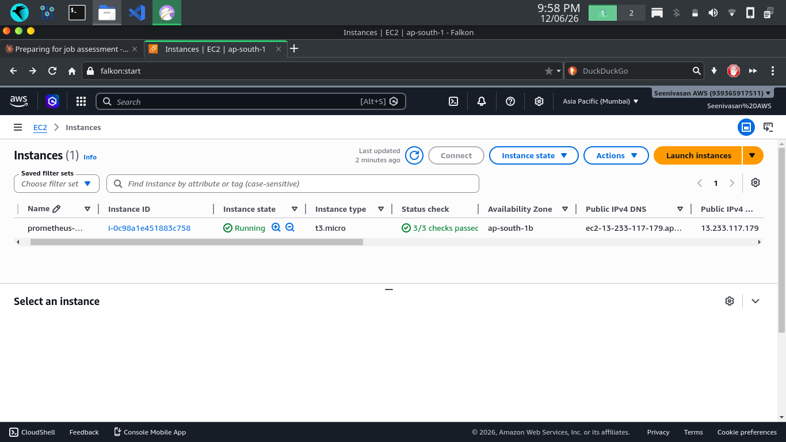
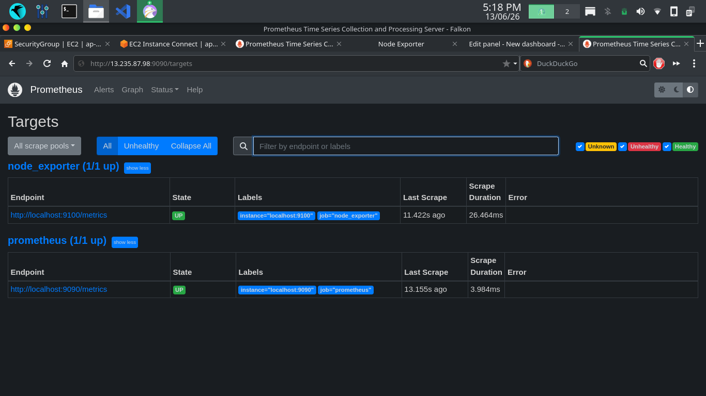
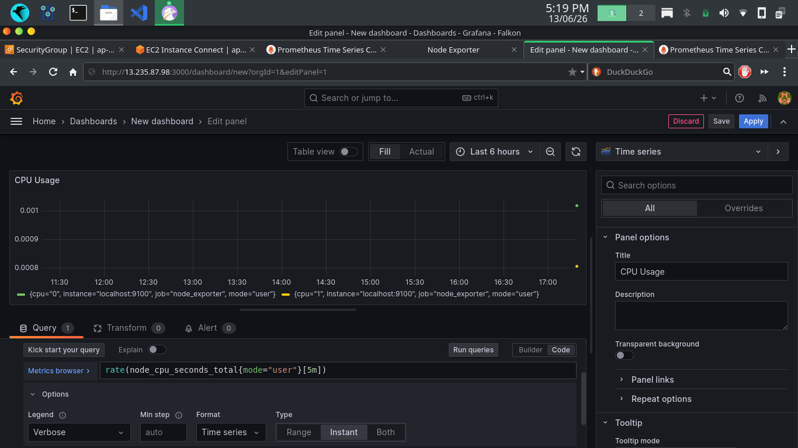
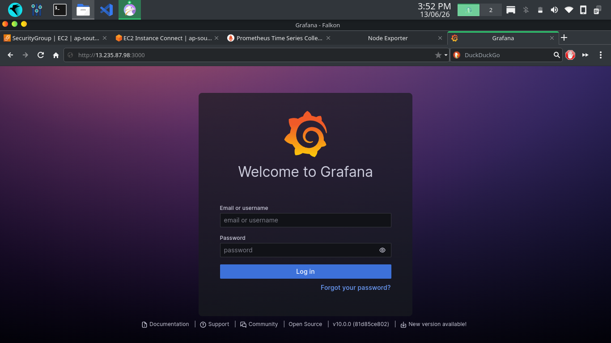
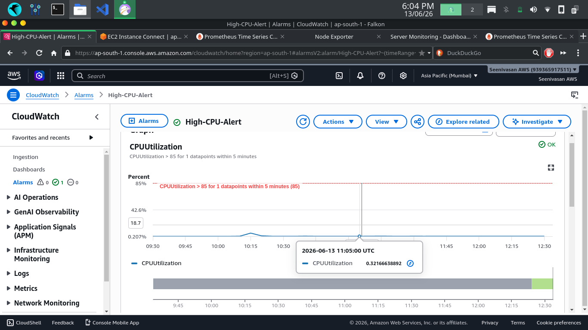

# AWS Cloud Monitoring & Alerting System

## Project Overview
Deployed a cloud monitoring stack on AWS EC2 using Prometheus, Node Exporter, and Grafana to monitor system-level metrics with CloudWatch alerting.

## Services Used
- AWS EC2 (t3.micro)
- Prometheus v2.45.0
- Node Exporter v1.6.0
- Grafana v10.0.0
- AWS CloudWatch
- AWS SNS

## What I Built
- Launched EC2 instance on AWS (Mumbai region)
- Installed and configured Prometheus to scrape metrics at 15-second intervals
- Deployed Node Exporter to collect 5+ system metrics (CPU, memory, disk, network, I/O)
- Built Grafana dashboard with CPU Usage, Memory Usage, and Disk Usage panels
- Configured CloudWatch alarm for CPU >85% threshold with email notification via SNS

## Screenshots

### EC2 Instance Running

### Prometheus Targets Up

### Grafana CPU Graph

### Grafana Dashboard

### CloudWatch Alarm

